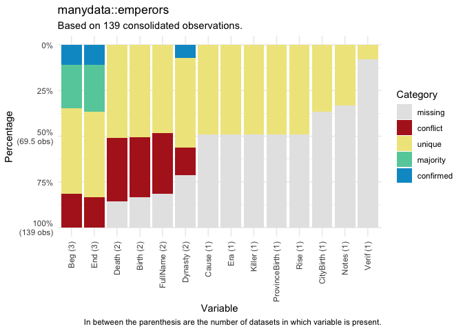

# manydata 

<!-- badges: start -->

[](https://lifecycle.r-lib.org/articles/stages.html#experimental)


<!-- [](http://hits.dwyl.com/globalgov/manydata) -->
[](https://app.codecov.io/gh/globalgov/manydata?branch=main)
[](https://www.codefactdevtor.io/repository/github/globalgov/manydata)
[](https://bestpractices.coreinfrastructure.org/projects/4562)
<!--  -->
<!-- badges: end -->

`{manydata}` is the central package in the many packages universe aimed
at collecting, connecting, and correcting network data across
issue-domains of global governance. To assist users in doing so,
`{manydata}` contains functions that enable users to download and
manipulate data easily.

## Why manydata?

`{manydata}` offers users access to all of the tested data in the
various ‘many packages’ available, for use in analyses of global
governance and beyond. A special feature of the ‘many packages’ is that
it is not ‘opinionated’ - instead of offering a single, supposedly
authoritative version of global governance events, the packages in the
many packages universe gather well-regarded datasets in each
issue-domain into three-dimensional ‘datacubes’. The chief advantage of
this for global governance researchers is that it enables a quick and
easy way to check the robustness of their results using different
formulations of the study population or concept specification. The
‘datacube’ structure has a specific coding system for the variables
across the datasets. For more details, please see the
[vignette](https://globalgov.github.io/manydata/articles/user.html).

## Downloading and installing manydata

The easiest way to install `{manydata}` is directly from CRAN.

``` r
install.packages("manydata")
```

The development version of the package `{manydata}` can also be
downloaded from GitHub.

``` r
# install.packages("remotes")
remotes::install_github("globalgov/manydata")
```

## Available ‘many’ packages

`{manydata}` connects users to other packages that help fill global
governance researchers’ data needs. The `get_packages()` function can be
used to discover the ‘many packages’ currently available.

``` r
library(manydata)
get_packages()
```

Please see [the website](https://globalgov.github.io/manydata/) for more
information about how to use `{manydata}`.

## Visualising ‘many’ databases

Once ‘many’ data packages are downloaded, `{manydata}` helps users
visualize the relationship between matched observations across datasets
within a database. Database profiling functions return confirmed,
unique, missing, conflicting, or majority values in all (non-ID)
variables in the datasets for a ‘many’ package database.

``` r
db_plot(database = emperors, key = "ID", variable = "all", category = "all")
```

    #> There were 116 matched observations by ID variable across datasets in database.



## Consolidating ‘many’ databases

`{manydata}` also contains flexible methods for consolidating ‘many’
package database into a single dataset with some combination of the
rows, columns, as well as for how to resolve conflicts for observations
across datasets.

``` r
consolidate(database = emperors, rows = "every", cols = "every",
            resolve = "coalesce", key = "ID")
```

    #> There were 116 matched observations by ID variable across datasets in database.

    #> # A tibble: 41 × 3
    #>    ID             Beg         End        
    #>    <chr>          <mdate>     <mdate>    
    #>  1 Aemilian       0253-08-15~ 0253-10-15~
    #>  2 Augustus       -0026-01-16 0014-08-19 
    #>  3 Aurelian       0270-09-15  0275-09-15 
    #>  4 Balbinus       0238-04-22  0238-07-29 
    #>  5 Caracalla      0198        0217-04-08 
    #>  6 Carinus        0283-08-01~ 0285-08-01~
    #>  7 Carus          0282-10-01~ 0283-08-01~
    #>  8 Claudius       0041-01-25  0054-10-13 
    #>  9 Commodus       0177        0192-12-31 
    #> 10 Constantine II 0337-05-22  0340-01-01 
    #> # … with 31 more rows

## Cheat Sheet

`{manydata}` contains several other functions to help global governance
researchers. For a quick overview, please also check the package cheat
sheet.

<a href="https://github.com/globalgov/manydata/blob/main/man/figures/cheatsheet.pdf"></a>

## Contributing to the many packages universe

For more information for developers and data contributors to ‘many
packages’, please see `{manypkgs}` [the
website](https://globalgov.github.io/manypkgs/).
