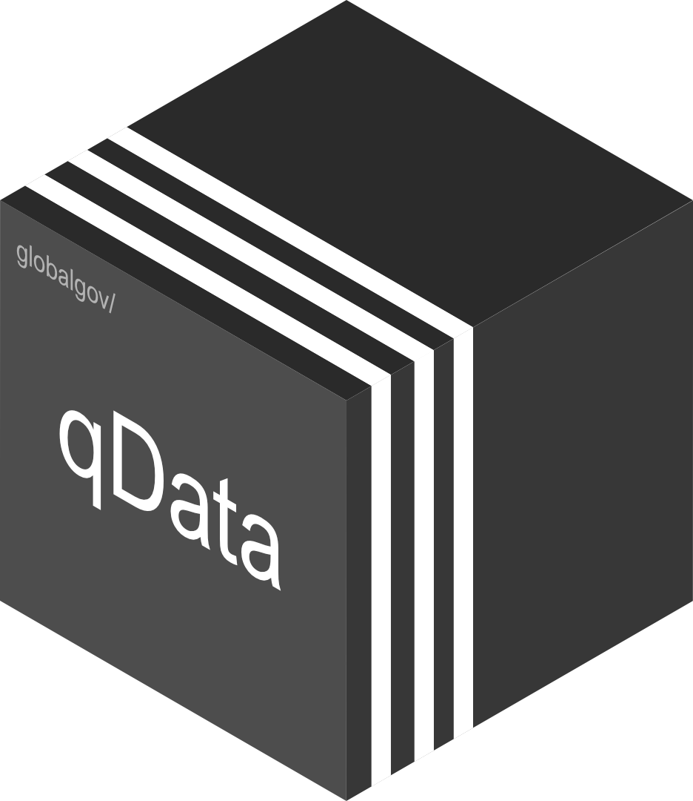

# qData 

<!-- badges: start -->

[](https://www.tidyverse.org/lifecycle/#experimental)
 

<!-- [](http://hits.dwyl.com/globalgov/qData) -->
[](https://codecov.io/gh/globalgov/qData?branch=main)
[](https://www.codefactor.io/repository/github/globalgov/qdata)
[](https://bestpractices.coreinfrastructure.org/projects/4562)
<!--  -->
<!-- badges: end -->

`{qData}` is the central package in an ecosystem of packages aimed at
collecting, connecting and correcting network data across issue-domains
of global governance. It is a package both for users of this data as
well as for data owners and contributors.

## Why qData?

For users, `{qData}` offers a way to access all of the tested data in
the ecosystem in so-called ‘qPackages’, and use this data in their
analyses of global governance. A special advantage of such qdata is that
it is not ‘opinionated’, in the sense of offering a single, supposedly
authoritative version of global governance events, but instead holds
many well-regarded datasets together in three-dimensional ‘datacubes’.
The chief advantage of this for global governance researchers is that it
enables a quick and easy way to check the robustness of their results to
different formulations of the study population or concept specification.
The ‘datacube’ structure is requiring specific coding system for the
variables across the datasets. For more details on that, please see the
[vignette](https://globalgov.github.io/qData/articles/user.html).

For contributors, `{qData}` provides the necessary tools to put their
data in the hands of users. The package includes many functions to make
this easier. It includes functions to help set up a qPackage, import
their existing data, and export them in structures consistent with the
rest of the data ecosystem. This facilitates the interoperability,
contrast, and comparison of data. Specific coding system should be
followed by the contributors. For more details on that, please see the
[vignette](https://globalgov.github.io/qData/articles/developer.html).

## Downloading and installing qData

The development version of the package `{qData}` can be downloaded from
GitHub.

``` r
# install.packages("remotes")
remotes::install_github("globalgov/qData")
```

## Available qPackages

`{qData}` connects users to other packages that help fill global
governance researchers’ data needs. The `get_packages()` function can be
used to discover which packages are currently available.

``` r
library(qData)
get_packages()
```

    ## # A tibble: 3 x 6
    ##   name     full_name         
    ##   <chr>    <chr>             
    ## 1 qData    globalgov/qData   
    ## 2 qEnviron globalgov/qEnviron
    ## 3 qStates  globalgov/qStates 
    ##   description                                             installed latest
    ##   <chr>                                                   <chr>     <chr> 
    ## 1 An R portal for ensembled global governance data        0.3.5     0.3.4 
    ## 2 qPackage for ensembled data on environmental agreements 0.0.2     0.0.2 
    ## 3 qPackage for ensembled data on sovereign states         0.0.3     0.0.3 
    ##   updated   
    ##   <date>    
    ## 1 2021-03-23
    ## 2 2021-02-22
    ## 3 2021-02-22

Please see [the website](https://globalgov.github.io/qData/) for more
information about how to use `{qData}` as either a user or as a data
contributor.
