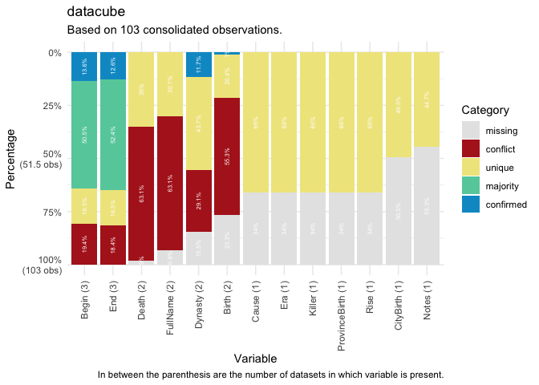

# manydata 

<!-- badges: start -->

[](https://lifecycle.r-lib.org/articles/stages.html#experimental)


<!-- [](http://hits.dwyl.com/globalgov/manydata) -->
[](https://app.codecov.io/gh/globalgov/manydata?branch=main)
[](https://www.codefactor.io/repository/github/globalgov/manydata)
[](https://bestpractices.coreinfrastructure.org/projects/4562)
<!--  -->
<!-- badges: end -->

`{manydata}` is a portal to ‘many’ packages containing many datacubes,
each containing many related datasets on many issue-domains, actors and
institutions of global governance. `{manytreaties}` contains data on
international environmental, trade, and health agreements, and
`{manystates}`: contains data on states throughout history.

Datasets are related to one another within a datacube through a
particular coding system which follows the same principles across the
different packages.

For instance, in `{manytreaties}`, the `agreements` and `parties`
datacubes have standardised IDs (`manyID`), and date variables such as
`Begin` and `End` that denote the beginning and end dates of treaties
respectively. The beginning date is derived from the signature or entry
into force date, whichever is the earliest available date for the
treaty. Standardised IDs across datasets allow the same observations to
be matched across datasets so that the values can be compared or
expanded where relevant. These specific variable names allows the
comparison of information across datasets that have different sources.
It enables users to point out the recurrence, difference or absence of
observations between the datasets and extract more robust data when
researching on a particular governance domain.

The parties datacube contains additional date variables on each state
member’s ratification, signature, entry into force, and end dates for
each treaty. Data in the memberships datacube is comparable across
datasets through standardised state names and stateIDs, made possible
with the `manypkgs::code_states()` function. More information on each
state, including its `Begin` and `End` date, can be found in the
`{manystates}` package.

To enable users to work with the data in these packages, `{manydata}`
contains tools for:

- *calling* data packages,
- *comparing* individual datasets, and
- *consolidating* datacubes in different ways.

We intend for `{manydata}` to be useful:

- at the **start** of a research project, to access and gather recent
  versions of well-regarded datasets, see what is available, describe,
  and explore the data,
- in the **middle** of a project, to facilitate analysis, comparison and
  modelling, and
- at the **end** of the project, to help with conducting robustness
  checks, preparing replication scripts, and writing the next grant
  application.

## Call ‘many’ packages

The easiest way to install `{manydata}` is directly from CRAN.

``` r
install.packages("manydata")
```

The development version of the package `{manydata}` can also be
downloaded from GitHub.

``` r
# install.packages("remotes")
remotes::install_github("globalgov/manydata")
```

Once `{manydata}` is installed, the `call_` functions can be used to
discover the ‘many packages’ currently available and/or download or
update these packages when needed. For this, the `call_packages()` can
be used.

``` r
library(manydata)
call_packages() # lists all packages currently available
call_packages("manytrade") # downloads and installs this package
```

The `call_sources()` function obtains information about the sources and
original locations of the desired datasets.

``` r
call_sources("emperors")
```

    #> # A tibble: 3 × 3
    #>   Dataset    Source                                                        URL  
    #>   <chr>      <chr>                                                         <chr>
    #> 1 Wikipedia  Wikipedia, 'List_of_Roman_emperors',  https://en.wikipedia.o… http…
    #> 2 UNRV       United Nations of Roma Victrix, 'Roman Emperor list', https:… http…
    #> 3 Britannica Britannica, 'List of Roman emperors', https://www.britannica… http…

## Comparing ‘many’ data

The first thing users of the data packages may want to do is to identify
datasets that might contribute to their research goals. One major
advantage of storing datasets in datacubes is that it facilitates the
comparison and analysis of multiple datasets in a specific domain of
global governance. To aid in the selection of datasets and the use of
data within datacubes, the `compare_` functions in `{manydata}` allows
users to quickly compare different information on datacubes and/or
datasets across ‘many packages’. These include comparison for data
observations, variables, and ranges, overlap among observations, missing
observations, and conflicts among observations.

For now, let’s work with the Roman Emperors datacube included in
manydata. We can get a quick summary of the datasets included in this
package with the following command:

``` r
data(package = "manydata")
data(emperors, package = "manydata")
emperors
```

We can see that there are three named datasets relating to emperors
here: `wikipedia` (dataset assembled from Wikipedia pages), `UNVR`
(United Nations of Roman Vitrix), and `britannica` (Britannica
Encyclopedia List of Roman Emperors). Each of these datasets has their
advantages and so we may wish to understand their similarities and
differences, summarise variables across them, and perhaps also rerun
models across them.

The `compare_dimensions()` function returns a tibble with the
observations and variables of each dataset within the specified datacube
of a many package.

``` r
compare_dimensions(emperors)
```

    #> # A tibble: 3 × 5
    #>   Dataset    Observations Variables                    Earliest_Date Latest_Date
    #>   <chr>      <chr>        <chr>                        <chr>         <chr>      
    #> 1 Wikipedia  69           ID, Begin, End, FullName, B… -0062-09-23   0421-09-02 
    #> 2 UNRV       98           ID, Begin, End, Birth, Deat… -0063-01-01   0518-12-31 
    #> 3 Britannica 87           ID, Begin, End               -0031-01-01   0491-12-31

<!-- The `compare_ranges()` function returns a tibble with the date range using the -->
<!-- earliest and latest dates of each dataset within the specified datacube of a many package. -->
<!-- ```{r compare range} -->
<!-- compare_ranges(emperors, variable = c("Begin", "End")) -->
<!-- ``` -->

The `compare_overlap()` function returns a tibble with the number of
overlapping observations for a specified variable (specify using the
`key` argument) across datasets within the datacube.

``` r
plot(compare_overlap(emperors, key = "ID"))
```


The `compare_missing()` function returns a tibble with the number and
percentage of missing observations in datasets within datacube.

``` r
plot(compare_missing(emperors))
```


Finally, the `compare_categories()` function help researchers identify
how variables across datasets within a datacube relate to one another in
five categories. Observations are matched by an “ID” variable to
facilitate comparison. The categories here include ‘confirmed’,
‘majority’, ‘unique’, ‘missing’, and ‘conflict’. Observations are
‘confirmed’ if all non-NA values are the same across all datasets, and
‘majority’ if the non-NA values are the same across most datasets.
‘Unique’ observations are present in only one dataset and ‘missing’
observations indicate there are no non-NA values across all datasets for
that variable. Observations are in ‘conflict’ if datasets have different
non-NA values.

``` r
plot(compare_categories(emperors, key = "ID"))
```



## Consolidating ‘many’ data

To retrieve an individual dataset from this datacube, we can use the
`pluck()` function.

``` r
pluck(emperors, "Wikipedia")
```

However, the real value of the various ‘many packages’ is that multiple
datasets relating to the same phenomenon are presented together.
`{manydata}` contains flexible methods for consolidating the different
datasets in a datacube into a single dataset. For example, you could
have the rows (observations) from one dataset, but add on some columns
(variables) from another dataset. Where there are conflicts in the
values across the different datasets, there are several ways that these
may be resolved.

The `consolidate()` function facilitates consolidating a set of
datasets, or a datacube, from a ‘many’ package into a single dataset
with some combination of the rows and columns. The function includes
separate arguments for rows and columns, as well as for how to resolve
conflicts in observations across datasets. The key argument indicates
the column to collapse datasets by. This provides users with
considerable flexibility in how they combine data.

For example, users may wish to see units and variables coded in “any”
dataset (i.e. units or variables present in at least one of the datasets
in the datacube) or units and variables coded in “every” dataset
(i.e. units or variables present in all of the datasets in the
datacube).

``` r
consolidate(datacube = emperors, join = "full",
            resolve = "coalesce", key = "ID")
```

    #> # A tibble: 103 × 14
    #>    ID       Begin End   FullName Birth Death CityBirth ProvinceBirth Rise  Cause
    #>    <chr>    <mda> <mda> <chr>    <mda> <mda> <chr>     <chr>         <chr> <chr>
    #>  1 Aemilian 0253… 0253… Caesar … 0207… 0253… <NA>      Africa        Appo… Assa…
    #>  2 Allectus 0293… 0297… ?        NA  … 0297… <NA>      <NA>          <NA>  <NA> 
    #>  3 Anastas… 0491… 0518… Flavius… 0430… 0518… <NA>      <NA>          <NA>  <NA> 
    #>  4 Anthemi… 0467… 0472… Procopi… 0420… 0472… <NA>      <NA>          <NA>  <NA> 
    #>  5 Antonin… 0138… 0161… Caesar … 0086… 0161… Lanuvium  Italia        Birt… Natu…
    #>  6 Arcadius 0395… 0408… Flavius… 0377… 0408… <NA>      <NA>          <NA>  <NA> 
    #>  7 Augustus -002… 0014… Imperat… -006… 0014… Rome      Italia        Birt… Assa…
    #>  8 Aurelian 0270… 0275… Caesar … 0214… 0275… Sirmium   Pannonia      Appo… Assa…
    #>  9 Avitus   0455… 0456… Marcus … 0395… 0456… <NA>      <NA>          <NA>  <NA> 
    #> 10 Balbinus 0238… 0238… Caesar … 0178… 0238… <NA>      Unknown       Appo… Assa…
    #> # ℹ 93 more rows
    #> # ℹ 4 more variables: Killer <chr>, Dynasty <chr>, Era <chr>, Notes <chr>

``` r
consolidate(datacube = emperors, join = "inner",
            resolve = "coalesce", key = "ID")
```

    #> # A tibble: 65 × 14
    #>    ID       Begin End   FullName Birth Death CityBirth ProvinceBirth Rise  Cause
    #>    <chr>    <mda> <mda> <chr>    <mda> <mda> <chr>     <chr>         <chr> <chr>
    #>  1 Augustus -002… 0014… Imperat… -006… 0014… Rome      Italia        Birt… Assa…
    #>  2 Tiberius 0014… 0037… Tiberiv… -004… 0037… Rome      Italia        Birt… Assa…
    #>  3 Caligula 0037… 0041… Gaivs I… 0012… 0041… Antitum   Italia        Birt… Assa…
    #>  4 Claudius 0041… 0054… Tiberiv… -000… 0054… Lugdunum  Gallia Lugdu… Birt… Assa…
    #>  5 Nero     0054… 0068… Nero Cl… 0037… 0068… Antitum   Italia        Birt… Suic…
    #>  6 Galba    0068… 0069… Servivs… -000… 0069… Terracina Italia        Seiz… Assa…
    #>  7 Otho     0069… 0069… Marcvs … 0032… 0069… Terentin… Italia        Appo… Suic…
    #>  8 Vitelli… 0069… 0069… Avlvs V… 0015… 0069… Rome      Italia        Seiz… Assa…
    #>  9 Vespasi… 0069… 0079… Titvs F… 0009… 0079… Falacrine Italia        Seiz… Natu…
    #> 10 Titus    0079… 0081… Titvs F… 0039… 0081… Rome      Italia        Birt… Natu…
    #> # ℹ 55 more rows
    #> # ℹ 4 more variables: Killer <chr>, Dynasty <chr>, Era <chr>, Notes <chr>

Users can also choose how they want to resolve conflicts between
observations in `consolidate()` with several ‘resolve’ methods:

- coalesce: the first non-NA value
- max: the largest value
- min: the smallest value
- mean: the average value
- median: the median value
- random: a random value

``` r
consolidate(datacube = emperors, join = "full", resolve = "max", key = "ID")
```

    #> # A tibble: 103 × 14
    #>    ID       Begin End   FullName Birth Death CityBirth ProvinceBirth Rise  Cause
    #>    <chr>    <mda> <mda> <chr>    <mda> <mda> <chr>     <chr>         <chr> <chr>
    #>  1 Aemilian 0253… 0253… "Marcus… 0207… 0253… <NA>      Africa        Appo… Assa…
    #>  2 Allectus 0293… 0297… "?"      NA  … 0297… <NA>      <NA>          <NA>  <NA> 
    #>  3 Anastas… 0491… 0518… "Flaviu… 0430… 0518… <NA>      <NA>          <NA>  <NA> 
    #>  4 Anthemi… 0467… 0472… "Procop… 0420… 0472… <NA>      <NA>          <NA>  <NA> 
    #>  5 Antonin… 0138… 0161… "Titus … 0086… 0161… Lanuvium  Italia        Birt… Natu…
    #>  6 Arcadius 0395… 0408… "Flaviu… 0377… 0408… <NA>      <NA>          <NA>  <NA> 
    #>  7 Augustus -003… 0014… "Impera… -006… 0014… Rome      Italia        Birt… Assa…
    #>  8 Aurelian 0270… 0275… "Lucius… 0214… 0275… Sirmium   Pannonia      Appo… Assa…
    #>  9 Avitus   0455… 0456… "Marcus… 0395… 0456… <NA>      <NA>          <NA>  <NA> 
    #> 10 Balbinus 0238… 0238… "Decimu… 0178… 0238… <NA>      Unknown       Appo… Assa…
    #> # ℹ 93 more rows
    #> # ℹ 4 more variables: Killer <chr>, Dynasty <chr>, Era <chr>, Notes <chr>

``` r
consolidate(datacube = emperors, join = "inner", resolve = "min", key = "ID")
```

    #> # A tibble: 65 × 14
    #>    ID       Begin End   FullName Birth Death CityBirth ProvinceBirth Rise  Cause
    #>    <chr>    <mda> <mda> <chr>    <mda> <mda> <chr>     <chr>         <chr> <chr>
    #>  1 Augustus -002… -0014 Gaius J… -006… 0014  Rome      Italia        Birt… Assa…
    #>  2 Tiberius 0014… 0037  Tiberiu… -004… 0037  Rome      Italia        Birt… Assa…
    #>  3 Caligula 0037… 0041  Gaius C… 0012… 0014  Antitum   Italia        Birt… Assa…
    #>  4 Claudius 0041… 0054  Tiberiu… -000… 0041  Lugdunum  Gallia Lugdu… Birt… Assa…
    #>  5 Nero     0054… 0068  Claudiu… 0037… 0068  Antitum   Italia        Birt… Suic…
    #>  6 Galba    0068… 0069  Servius… -000… 0069  Terracina Italia        Seiz… Assa…
    #>  7 Otho     0069… 0069  Marcus … 0032… 0069  Terentin… Italia        Appo… Suic…
    #>  8 Vitelli… 0069… 0069  Aulus V… 0015… 0069  Rome      Italia        Seiz… Assa…
    #>  9 Vespasi… 0069… 0079  Titus F… 0009… 0079  Falacrine Italia        Seiz… Natu…
    #> 10 Titus    0079… 0081  Titus F… 0039… 0079  Rome      Italia        Birt… Natu…
    #> # ℹ 55 more rows
    #> # ℹ 4 more variables: Killer <chr>, Dynasty <chr>, Era <chr>, Notes <chr>

Alternatively, users can “favour” a dataset in a datacube over others:

``` r
consolidate(emperors[c("UNRV","Britannica","Wikipedia")], join = "left", resolve = "coalesce", key = "ID")
```

    #> # A tibble: 98 × 14
    #>    ID     Begin End   Birth Death FullName Dynasty CityBirth ProvinceBirth Rise 
    #>    <chr>  <mda> <mda> <mda> <mda> <chr>    <chr>   <chr>     <chr>         <chr>
    #>  1 Augus… -0027 -0014 -0063 0014  Gaius J… Julio-… Rome      Italia        Birt…
    #>  2 Tiber… 0014  0037  -0042 0037  Tiberiu… Julio-… Rome      Italia        Birt…
    #>  3 Calig… 0037  0041  0012  0014  Gaius C… Julio-… Antitum   Italia        Birt…
    #>  4 Claud… 0041  0054  -0010 0041  Tiberiu… Julio-… Lugdunum  Gallia Lugdu… Birt…
    #>  5 Nero   0054  0068  0037  0068  Claudiu… Julio-… Antitum   Italia        Birt…
    #>  6 Galba  0068  0069  -0003 0069  Servius… Year o… Terracina Italia        Seiz…
    #>  7 Otho   0069  0069  0032  0069  Marcus … Year o… Terentin… Italia        Appo…
    #>  8 Vitel… 0069  0069  0015  0069  Aulus V… Year o… Rome      Italia        Seiz…
    #>  9 Vespa… 0069  0079  0009  0079  Titus F… Year o… Falacrine Italia        Seiz…
    #> 10 Titus  0079  0081  0039  0079  Titus F… Flavian Rome      Italia        Birt…
    #> # ℹ 88 more rows
    #> # ℹ 4 more variables: Cause <chr>, Killer <chr>, Era <chr>, Notes <chr>

## Cheatsheet

Please see the cheat sheet below for a quick overview:

<a href="https://github.com/globalgov/manydata/blob/develop/man/figures/cheatsheet.pdf"></a>

## Contributing to the many packages universe

For more information for developers and data contributors to ‘many
packages’, please see `{manypkgs}` [the
website](https://globalgov.github.io/manypkgs/).

## Funding details

Development on this package has been funded by the Swiss National
Science Foundation (SNSF) [Grant Number
188976](https://data.snf.ch/grants/grant/188976): “Power and Networks
and the Rate of Change in Institutional Complexes” (PANARCHIC).
